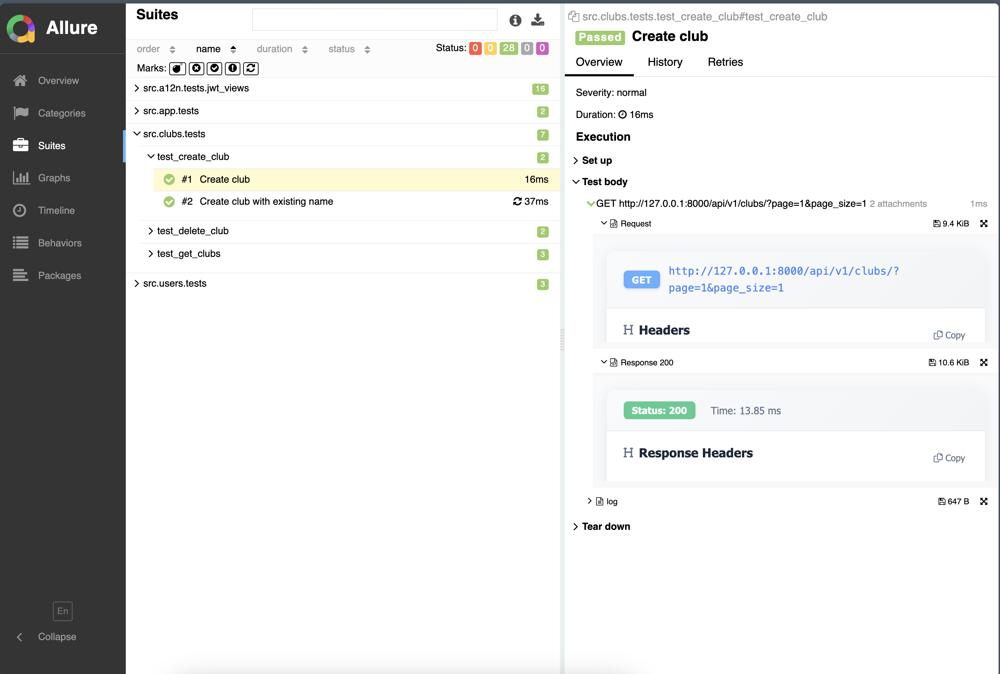
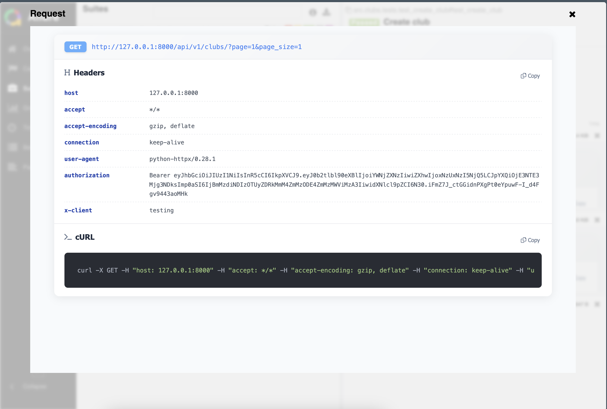

# 📚 API для книжного клуба

[](https://johnmakarov.github.io/book-club-api/coverage_report.html)
[](https://johnmakarov.github.io/book-club-api/allure-report/index.html)

## 🚀 Запуск проекта

### 🐳 Вариант с Docker

```bash
docker compose up -d
```

### 🛠 Ручная установка

1. **База данных**:

   - 🐘 Вариант A (Поднять через docker):

     ```bash
     docker compose up -d postgres
     ```

   - 💻 Вариант B (Запустить PostgreSQL на своем хосте)  
     *Не забудьте сменить настройки в `.env` если используете локальный PostgreSQL*

2. **Установка утилит**:
   - ⚡ [UV installer](https://docs.astral.sh/uv/getting-started/installation/)
   - 📦 [Taskfile](https://taskfile.dev/installation/)

3. **Настройка**:

   ```bash
   task migrate   # 🏗 Применить миграции
   task csu       # 👑 Создать суперпользователя
   task run       # 🚀 Запустить сервер
   task test      # 🧪 Запустить тесты
   ```

Вы можете просмотреть доступные команды введя ```task``` в свой терминал

## 🐘 Тесты

После запуска тестов вы можете просмотреть отчет о покрытии API автотестами
открыв index.html файл в корне проекта используя ```open index.html``` или альтернативу для вашей OS.

## 🏗 Структура проекта

- 📄 **OpenAPI документация**: [http://127.0.0.1:8000/api/v1/docs/swagger/#/](http://127.0.0.1:8000/api/v1/docs/swagger/#/)  
- 🔐 **Админ-панель**: [http://127.0.0.1:8000/admin/](http://127.0.0.1:8000/admin/)



